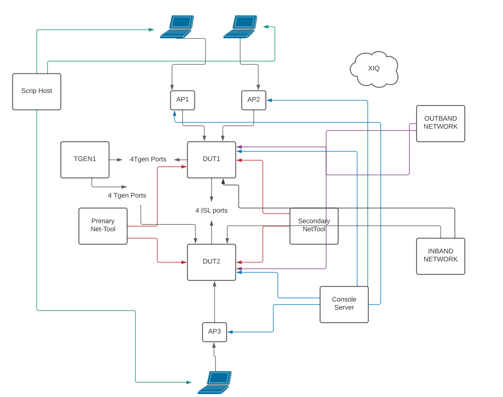

# Test Bed Standard Configurations

Every automated test must specify a testbed type.  The CI (Continous Integration) will check to ensure that one of the following testbed types is listed as a Marker (pyTest) or Tag (robot) before the test can be merged into any protected branches. 

The acceptable tags/markers are the same for Robot and pyTest. They can be found [here](../pytest.ini).

## Digital Twin Topologies

Digital Twin testbeds contain Digital Twin devices. Digital Twins are virtual machine deployments of Extreme products. Currently Digital Twin devices execute in either a VirtualBox or GNS3 environment. All test beds have JETS traffic generators and should be considered nearly equivalent the hardware that they emulate. EXOS, VOSS and AP Digital Twins can be onboarded to XIQ instances.

The Digital Twin testbed .yaml files should match the same format as the hardware .yaml files.

## Wired Topologies

We have standard wired test bed configurations that include setups for 1-5 node DUTs, traffic generators and a primary and secondary net-tools system. The user will need to choose from the topology diagrams below in order to ensure that all tests will run on a standard test setup.

### Wired 1-Node Topology

### Wired 2-Node Topology

### Wired 3-Node Topology

### Wired 4-Node Topology

### Wired 5-Node Topology (Legacy TCL only)

## Wireless Topologies

Wireless testbeds will contain at least one AP or Controller and no Wired devices.

## Wired/Wireless Topologies

Wired/Wireless Topologies contain at least one AP and one Wired (Router/Switch) device.

### Wired/Wireless 2-Node "Universal" Topology

# The Test Bed Yaml Files
The test bed yaml files have been standardized to ensure that they work with the extAuto and Econ Frameworks. All devices that are used in a test bed will be defined using the options below in a yaml file. There are example test bed files located [here](https://github.com/extremenetworks/extreme_automation_tests/tree/main/TestBeds/Templates). In this directory you will see the template files for the type.

The available keywords for devices are are:

- `netelem<number>` - Used for network elements (switches and routers).
- `tgen<number>` - Used for Traffic generators (Ixia, Sprient, Jets).
- `ap<number>` - Used for access points.
- `wing<number>` - Used for access point controllers.
- `mu<number>` - Used for mobile units (Smartphone, Laptop, etc.).
- `<server_type>_server<number>` - Used for servers of different types.
	- Currently supported servers: (a3, inband, kali, radius, tftp)
- `router<number>` - Used for legacy Aerohive routers.
- `aerohive_sw<number>` - Used for legacy Aerohive switches.

The available supporting keywords are:

- `lab` - Used to denote the physical location where the test beds, and the devices within them, exist.
- `mails` - Used for email accounts associated with the test bed.
- `tgen_ports` - Used to map out the connections between traffic generators and other devices within the test bed.

The test bed yaml files have been standardized to ensure that they work with the extAuto and Econ Frameworks. All devices that are used in a test bed will be defined using the options below in a yaml file. There are example test bed files located [here](https://github.com/extremenetworks/extreme_automation_tests/tree/priv_elatour_config_files_update/TestBeds/Templates). In this directory you will see the template files for the type.

### Test Bed Yaml Machine Types
All machine types are defined by the name and a number. For example the 1st and 2nd netelem should be defined as the following:

	netelem1
	netelem2
	tgen1
	tgen2
	endsys1
	endsys2

	netelem[x]      - The Network Element (switch)
	tgen[x]	        - The Traffic Generator Element
	endsys[x]       - The End System machine

