## Requirements
This guide assumes that you have pulled the extreme_automation_framework and extreme_automation_tests repositories and have created the virutal environment. It also asssumes that you have installed the correct requirements for the Automation Framework and pytest by installing the requirements.txt in your virtual enviroment. Please continue if this is the case, otherwise complete the Setup for Framework steps in the [README](../README.md) before continuing.

## Set your PYTHONPATH
Make sure that your PYTHONPATH is set for both the extreme_automation_tests and extreme_automation_framework repositories.

### PYTHONPATH - Linux
Use the `export` command to set the paths. You can set this in your ~./bashrc to automatically execute when you log in. The command is:

    export PYTHONPATH=<directory where your source is>/extreme_automation_tests:<directory where your source is>/extreme_automation_framework

### PYTHONPATH - Windows
You can set your PYTHON path using the windows environment variables. click on the start menu and type: `environment`, above you should see the menu option.

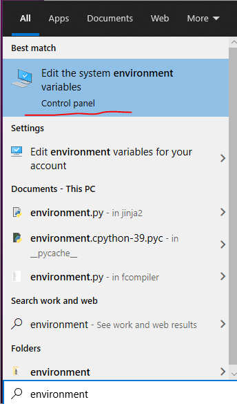

When the window appears click on the Environment Variables button. Under the system variables click on the new button and enter in the following information:

    Variable name: PYTHONPATH
    Variable value: <directory where your source is>\extreme_automation_tests:<directory where your source is>\extreme_automation_framework

Click on the OK button and restart any windows terminal / Pycharm so that the changes are read in.

## Pycharm IDE
Download the [Pycharm IDE](https://www.jetbrains.com/pycharm/download/#section=windows) and install it on your development system. 

### Creating a New Project
Start up pycharm and the when the IDE is loaded there should be a `Welcome to PyCharm` window open. Select the 
`Open` button if that windows doesn't show up. You can select open from the top menu: navigate to File-->Open...

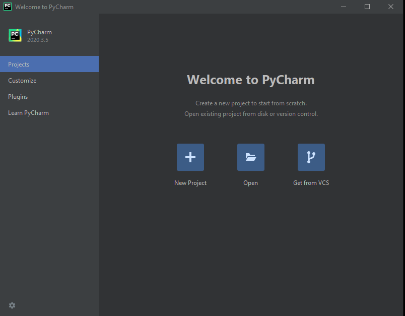

First you will load the `extreme_automation_tests` code to the project and next you will load the `extreme_automation_framework` code and attach it to the same project.

        1. From the PyCharm UI, navigate to File-->Open...
        1. Navigate to extreme_automation_tests directory and click ok.
        1. From the PyCharm UI, navigate to File-->Open...
        1. Navigate to extreme_automation_framework directory and click ok.
        1. Select 'Attach'.
        1. From the PyCharm UI, navigate to File-->Open...
        1. Navigate to cw_automation directory and click ok.
        1. Select 'Attach'.
        1. Hit OK.

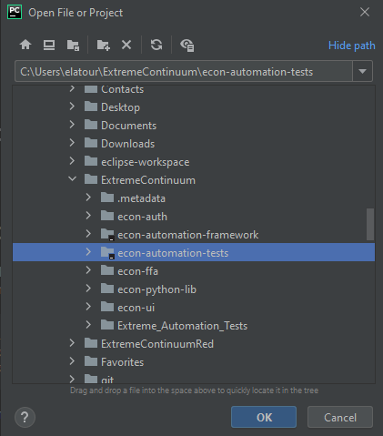
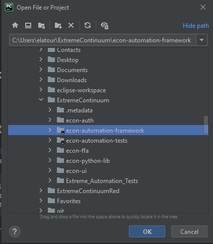

## Configuration of the Environment
In order to execute tests the user must configure the python environement for PyCharm.

        1. Select File --> Settings from the top level menu.
        2. Under settings on the left hand tree select Project: extreme_automation_tests and expand that to show the Python Interpreter and click on it.
        3. The right hand screen will show the list of Python Interpreter this should be empty.
        4. Select the gear button next to the drop down for Python Interpreter and click on 'add'.

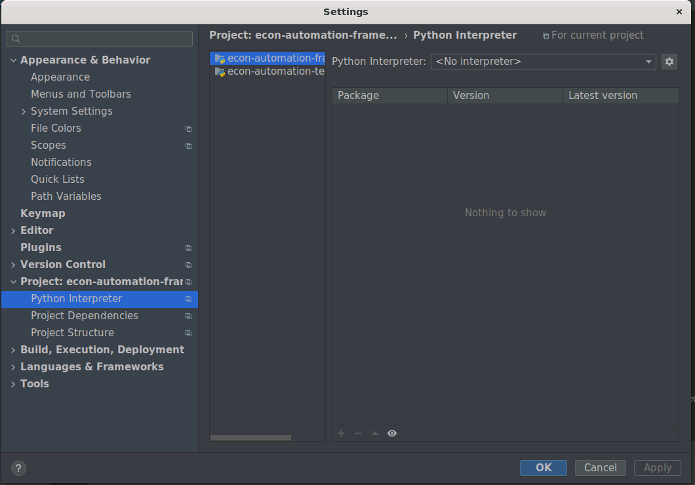

  
        5. Select Existing environment and click on the ... button to add your environement.
        6. Select the directory that the python3 execuable it located in and click ok.

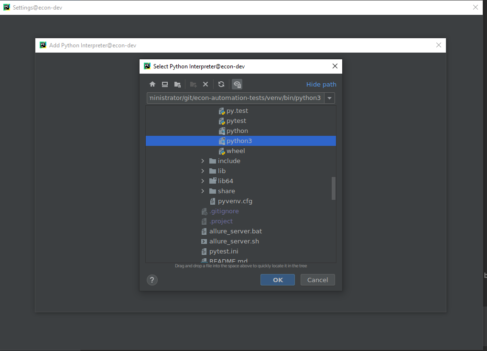

        7. Make sure the check the Make available to all project check box and click ok

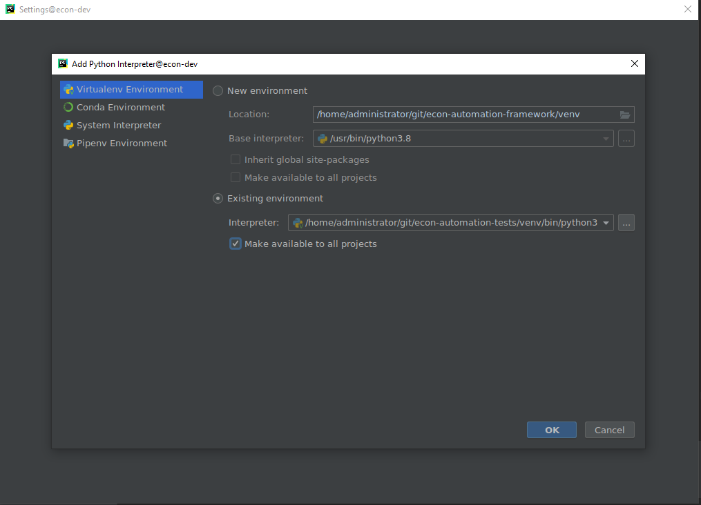

        8. Next select the extreme_automation_tests project and select the same python interpreter.

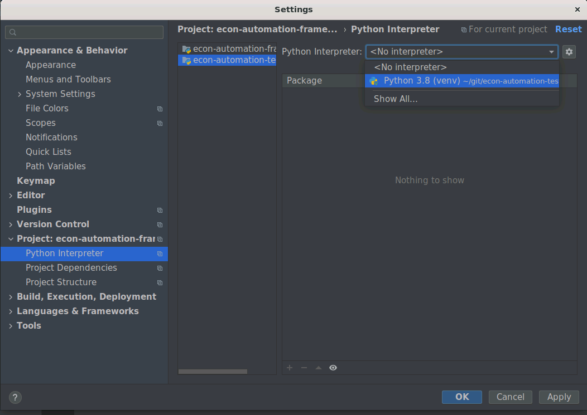

        9. Next select the Project Dependencies and select the extreme_automation_tests and make sure that the econ-automation-framework is checked. Click apply and ok.

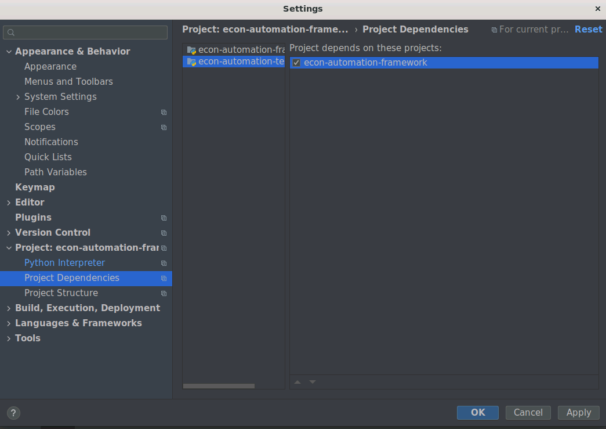

## Configration for Reporting
You will need to install the [Allure](https://docs.qameta.io/allure/) reporting package on the development system. 

### Linux
Issue the following commands to install the package.

    sudo apt-add-repository ppa:qameta/allure
    sudo apt-get update 
    sudo apt-get install allure

### Windows

Allure is available from the [Scoop](https://scoop.sh/) commandline-installer.
To install Allure, download and install Scoop and then execute in the following command in Powershell:

    scoop install allure
    
### Starting the Allure Report Server
Two script have been included in the `extreme_automation_tests` repository to allow users to start the allure reporitng server. In the root of this repository type the following command:

Linux:
    
       ./allure_server.sh
       
 Windows:
 
    allure_server.bat
    
The allure server should start up and launch the broswer so that you can see your reports. The service may need to be restarted when you do additiional test runs. You can control-c the server and start it again. If you have too much test data in the reporting you can clean out the directory allure_output in the root of the `extreme_automation_tests` and run the test again to produce new reporting output.
    

## Configuration to Execute / Debug a Test

    1. From the top level menu, select Run-> Edit Configurations...

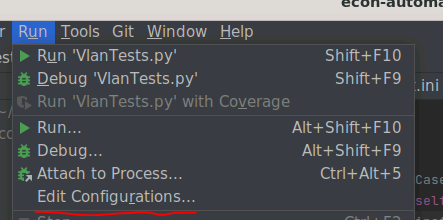

    2. Select pytest from the tree and click on Create Configuration at the top.

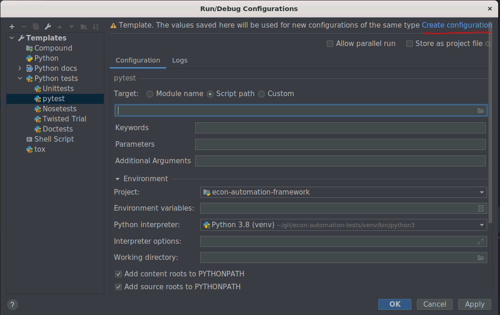

    3. Enter in the name of the test. Here I have added the name of one of the demo tests.
    4. Enter in the script path for the test.
    4. Enter in the additional arguments that will include the following:
        
        --tc-file=<Path to Test Bed yaml file>
        
    5. Set the working Directory to the root of the test repoistory (extreme_automation_tests)

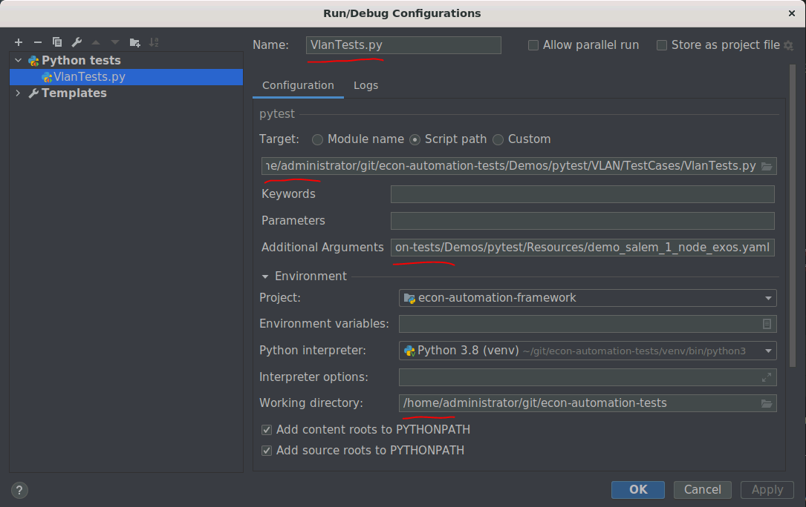

Now you should be able to open the test case file and set break points and run the debugger. 

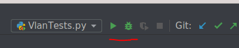

    6. You can lauch the run or debug session with the top menu, just select the test in the dropdown and press the debug button.

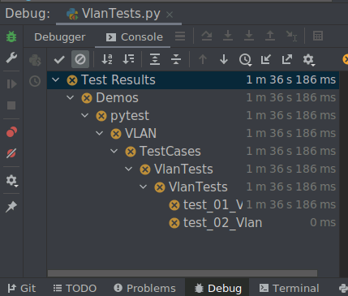

    7. When debugging the test case the controls from stepping through the code are located at the bottom of the window.

