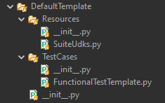
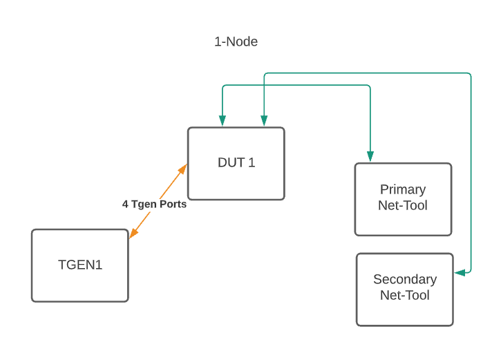
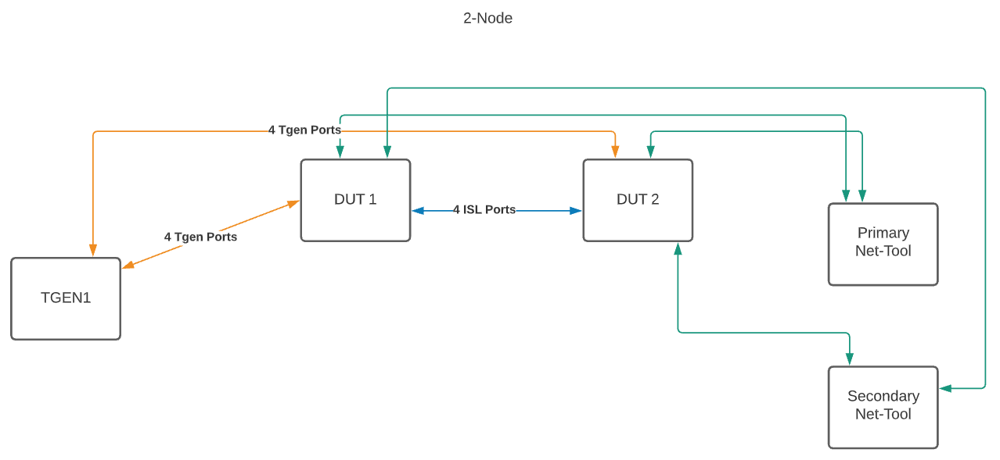
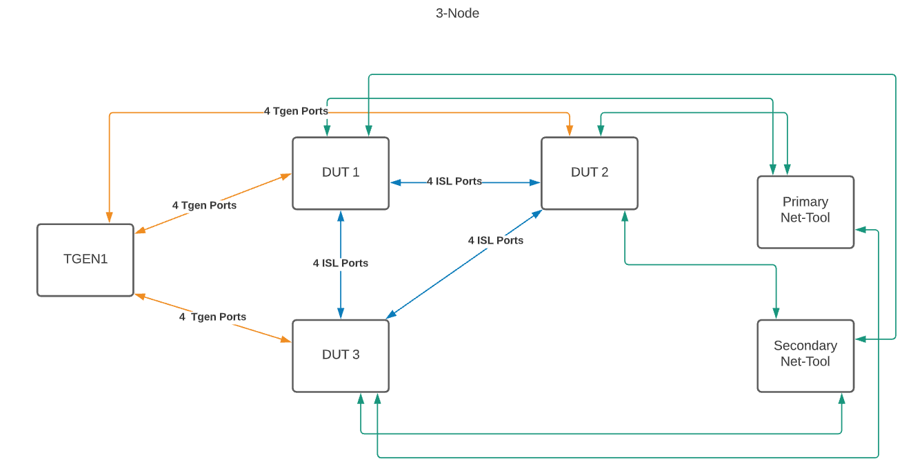
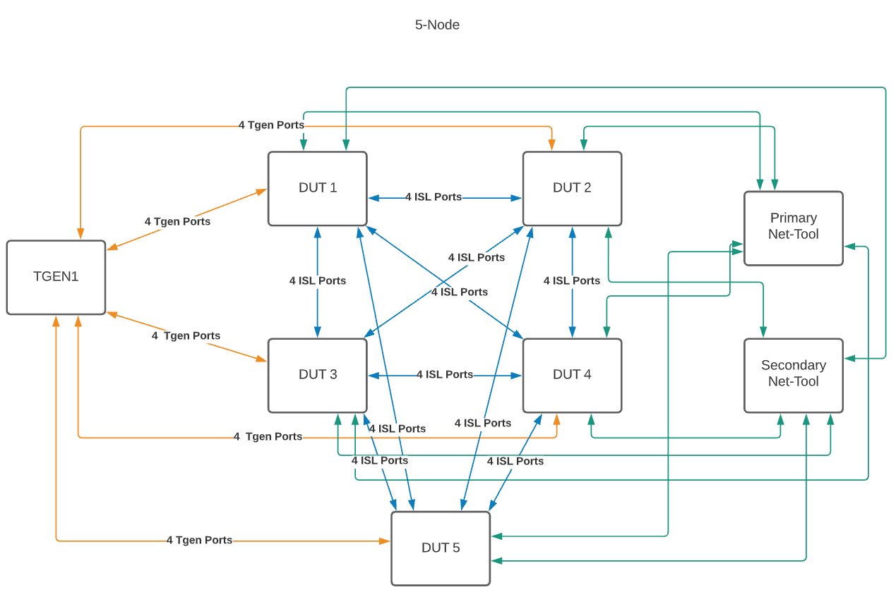
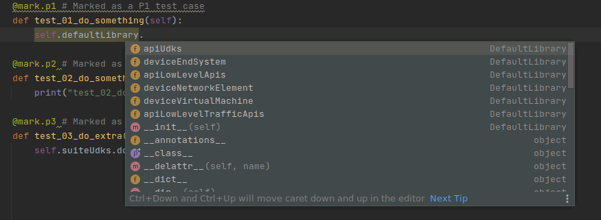
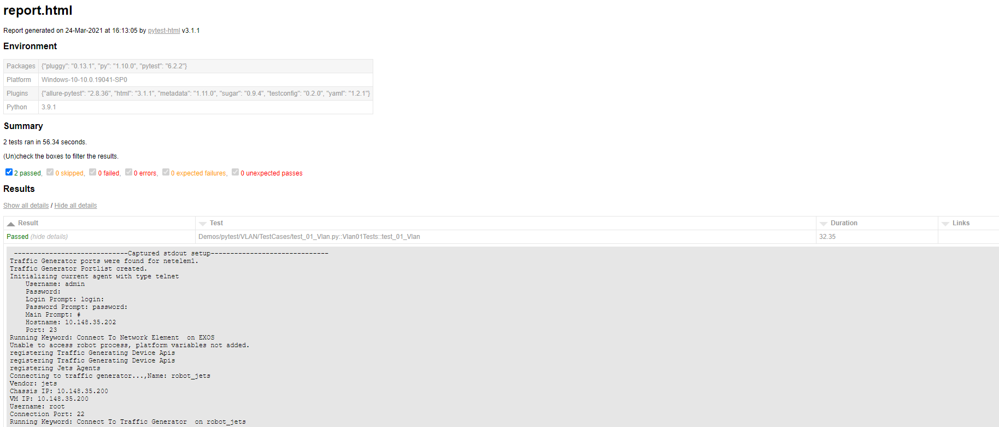

# Test Case Creation Guidelines
In this document you will learn how to create a new Test Suite with test cases. To ensure that all tests are simliar in design and file structure, please use the following format defined in the default template located in the econ-automation-test repository: `/econ-automation-tests/Demos/pytest/DefaultTemplate`.

The file strucution contains a top level directory ( the test suite name ) and two directories under it.

* Resources -  This is where the test resources are kept.
* Test Cases - This is where the test cases files are kept.

### Resources
The `Resources` directory will contain a SuiteUDK.py file that will allow the users to write functions that are needed for the test and are not supported in the main framework.

### Test Cases
The `Test Cases` directory will contain the test case files. The file format should be the folllowing:

	Format:
		test_<number>_<test case name>.py

	Example:
		test_01_Vlan.py

Pytest will only understand files with a `test_` prefix.  

The class name inside the test file must have `Tests` at the end of the name. For example:

	class Vlan01Tests():

Test cases within the class must have a `test_` prefix in the function name so that pytest will know that it is a test and not helper function. For Example:

	def test_create_vlan():

### The Test Case Class
The name of the class must have the `Tests` postfix. Also, the name of the test class file must have the prefix of `test_`. For example:

	# The name of the class file
	test_01_Vlan.py

	# The name of the class defined inside the class file
	class Vlan01Tests():
		

## Understanding The Files Within the Test Suite
The core parts of a pytest test suite are as follows:

The Resources Directory:

*	`SuiteUdks.py`: Location where all suite specific user defined keywords can be created.

The TestCases Directory:
*	`test_FunctionalTemplate.py`: A pytest test case file.

## Understanding the Test Bed Yaml File
The test bed file consists of elements  (NetworkElements, Traffic Generators, End Systems ) and port configurations. The main types for elements are:

* netelem<number> - This is the network element (switch). The number after it is a unique identifier.
* tgen<number> - The Traffic Generator element (Ixia, Sprient, Jets). The number after it is a unique identifier.
* endsystem<number> - The end system (Linux box, or other system). The number after it is a unique identifier.

All element types have common attributes such as name, ip, port. Please refer to the [Templates Directory](https://github.com/extremenetworks/extreme_automation_tests/tree/main/TestBeds/Templates) file for details on the required and optional parameters for all element types.

## Test Bed Standard Configurations
We have standard test bed configurations that include setups for 1-5 node DUTs, traffic generators and a primary and secondary net-tools system. The user will need to choose from the topology diagrams below in order to ensure that all tests will run on a standard test setup. 

### 1-Node Topology

### 2-Node Topology

### 3-Node Topology

### 4-Node Topology

### 5-Node Topology (Legacy TCL only)

## Variables in the YAML file in Pytest
Any variables that you define in the test bed yaml can be accessed in the test case file via this syntax below. The config object is a dictionary of all of the yaml file parameters allowing access to anything defined in the Yaml files. A PytestConfigHelper class exists to help with configuration and is explained below.

Global Dictionary:
	config

Accessing the first switch object:

	config['netelem1']

The example above will access the following part of the test bed yaml file:

	netelem1:
		name:                     "EXOS"
		ip:                       "10.148.35.202"
		port:                     "23"
		mgmt_vlan:                "VLAN_4000"

The nested values in the yaml file are aceesed in Pytest by the dot notation when using the [pytestConfigHelper](https://github.com/extremenetworks/econ-automation-framework/blob/main/ExtremeAutomation/Imports/pytestConfigHelper.py) library. In the example below you can use the library by loading the config object, then calling the value.

	To Load:

		def setup_class(self):
			# Create an instance of the helper class that will read in the test bed yaml file and provide basic methods and variable access.
			# The user can also get to the test bed yaml by using the config dictionary
			self.tb = PytestConfigHelper(config)
	

	To Use:

		self.tb.dut1 #to get access to the DUT1 (netlelem1) object.

We have provided helper accessor for common variables for DUTs and ports. Check out the [library](https://github.com/extremenetworks/econ-automation-framework/blob/main/ExtremeAutomation/Imports/pytestConfigHelper.py) for details.

## Pytest Execution Helper
Pytest will not skip execution of tests or run the test teardown when the test step fails. To fix this issues, we have provided a helper class called [PytestExecutionHelper](https://github.com/extremenetworks/econ-automation-framework/blob/main/ExtremeAutomation/Imports/pytestExecutionHelper.py). In the test class the user will need to instantiate this class:

	from ExtremeAutomation.Imports.pytestExecutionHelper import PytestExecutionHelper
	self.executionHelper = PytestExecutionHelper()

In the `setup_class` function the entire code should be surounded with a `try except` statement and have the execption call the `setSetupFailure` method on the `PytestExecutionHelper` instance. This will set the setup failure flag to allow test cases to be skipped with the call `testSkipCheck` in the test case.

	 # [Setup]  Test Case Setup
    def setup_class(self):
        try:
		...
        except Exception:
            # Setup has failed, so set the flag
            self.executionHelper.setSetupFailure(True)

In call test cases this method needs to be called in the first line:

	def test_01_Vlan(self):
        self.executionHelper.testSkipCheck()

Following these steps will ensure that the tests are skipped and the `teardown_class` is called when there is a failure in the `setup_class` fuction.

## Creating a Test Case
Note: all test cases should be created in the [Tests](https://github.com/extremenetworks/extreme_automation_tests/tree/main/Tests) area of this repository. From this directory there are the directories for Pytest and Robot, then we have Demos and Functional Areas. All tests should be under the nonprod directory until they are moved to the PROD area.

# Procedure:
1. 	Open the configured IDE (PyCharm or other IDE)
2.	Navigate to the DefaultTemplate directory
	(econ_automation_tests/Demos/pytest/DefaultTemplate)
3.	Make a copy of this (DefaultTemplate) directory with a new directory name of your choice in the following area of the Tests/Staging [repository](https://github.com/extremenetworks/extreme_automation_tests/tree/main/Tests).
4. Select a test bed topology that you will use to write you test. You can select one of the [standard test bed topologies](#Test-Bed-Standard-Configurations). When you write your test please ensure that you stick with the topology you have selected here. This will ensure that tests can be executed on a standard test bed setup.

5.	Rename test_FunctionalTemplate.py to a name of your choice. See [guidlines](#test-cases)
6.	Open the new test file and replace class name: `defaultTests` at the top with the name of your test. Be sure to not forget to include the `Tests` at the end of the name
7.	You are now ready to start writing your tests. Modify the `test_01_do_something` and udpdate the name: test_01_<your test>
8.	Remove the print statement and start by typing the following:
	 self.defaultLibrary

     
     
     Here you will notice some library options below. Using the dot notiation, you are able dig into these libraries to get to the function calls. 
     
     * apiUDK - All of the UserDefinedKeywords should be loaded from the [framework](https://github.com/extremenetworks/econ-automation-framework/blob/main/ExtremeAutomation/Imports/Udks.py)
     * apiLowLevelApis - All of the low level APIs for NOS, loaded from [framework](https://github.com/extremenetworks/econ-automation-framework/blob/main/ExtremeAutomation/Imports/LowLevelApis.py)
     * apiLowLevelTrafficApi - All of the low level APIs for traffic Generators, loaded from [framework](https://github.com/extremenetworks/econ-automation-framework/blob/main/ExtremeAutomation/Imports/LowLevelTrafficApis.py)
     * deviceEndSystem - All of the Keywords for End Systems, loaded from [framework](https://github.com/extremenetworks/econ-automation-framework/blob/main/ExtremeAutomation/Imports/EndSystemUtils.py.py)
     * deviceNetworkElement - All of the Keywords for Network Elements, loaded from [framework](https://github.com/extremenetworks/econ-automation-framework/blob/main/ExtremeAutomation/Imports/NetElementUtils.py)
     * deviceVirtualMachine - All of the Keywords for Virutal Machines, loaded from [framework](https://github.com/extremenetworks/econ-automation-framework/blob/main/ExtremeAutomation/Imports/VirtualMachineUtils.py)

     From here you can explore all of the libraries that are available to you to help you write you test. In the event that a low level API is not available we have provide speical functions to send CLI and Rest calls to the NOS. Please let the team know there is something missing so we can provide them in the future.    You can continue writing your test using the CLI and REST calls while waiting for the functionality to be added.

	self.defaultLibrary.deviceNetworkElement.networkElementCliSend.send_cmd
	self.defaultLibrary.deviceNetworkElement.networkElementCliSend.send_cmd_verify_output()
	self.defaultLibrary.deviceNetworkElement.networkElementCliSend.send_cmd_verify_output_regex()
	self.defaultLibrary.deviceNetworkElement.networkElementCliSend.send_cmd_verify_output_table()

1.	[Setup] Pytest using the following function name for the setup of the class: 

		def setup_class(self):

1.	[Teardown] is where we defined the keywords we want to run at the end of the test even if there is a failure/exception. Pytest will not run this function if the setup doesn't complete.

1.	During the task of writing cases you will likely come across keywords you want to use that are not avaible or have functions that are needed to perform task. We have created the Resource\SuiteUdks.py file for you to write any custom functions and code that you may need. If you think that the functions can be used with a wider group, then they could be added to the UDKs within the framework.

## Connecting to all Devices

Connect to all Network Elements and Traffic Generators:

	self.defaultLibrary.apiUdks.setupTeardownUdks.Base_Test_Suite_Setup()

Disconnect from all Network Elements and Traffic Generators:

	self.defaultLibrary.apiUdks.setupTeardownUdks.Base_Test_Suite_Cleanup()

Connect to a single Network Element:

	self.defaultLibrary.apiUdks.setupTeardownUdks.networkElementConnectionManager.connect_to_network_element(self.tb.dut1_name, self.tb.dut1.ip, self.tb.dut1.username, self.tb.dut1.password)

Connect to a single Traffic Generator:

	self.defaultLibrary.apiUdks.setupTeardownUdks.trafficGeneratorConnectionManager.connect_to_traffic_generator(self.tb.tgen1.name, self.tb.tgen1.vendor, self.tb.tgen1.chassis_ip, vm_ip, self.tb.tgen1.username, self.tb.tgen1.connection_port, 30, self.tb.tgen1.password)
	
	
## Finding Lower Level APIs

Low Level API are functions that can be called that will configure or show information for the NOS. When the UDK (User Defined Keywords) don't have the function that is required, the user can use the Low Level APIs to issue commands to the NOS.

Start with the base: `self.defaultLibrary.apiLowLevelApis` The the format should be:

	<protocol>.<protocol>_<action>_<event>

Actions:

- create
- delete
- set
- clear
- enable
- disable
- verify

Example: `self.defaultLibrary.apiLowLevelApis.port.port_enable_state()`

## Running a Test Suite
1.	In a command window, navigate to the based directory of your test suite (head of the Resources and TestCases directories)
1.	Issue the command `pytest --tc-file=TestEnvironments/<path to checked out yaml> TestCases` from a command prompt
1.	After your test completes a log file will be generated report.html and can be opened in a browser to see the results

Basic Pytest Reporting

### Allure

 If you installed [Allure](http://allure.qatools.ru/) you can also view the advanced reporting. To install Allure the directions are [here](PYCHARM.md#configration-for-reporting).

Advanced Allure Reporting:

